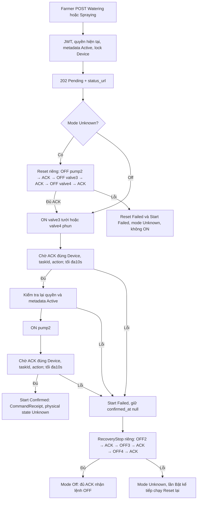
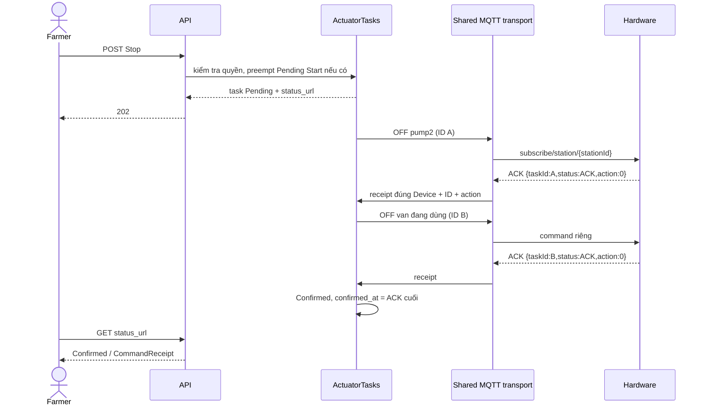

# ACTUATOR_TASKS — workflow đã chốt và đã code

2026-10-09, kế thừa DOCX MQTT v1 và các trả lời người dùng. API/dữ liệu/cấu hình/tái lập ở [implementation](ACTUATOR_TASKS_IMPLEMENTATION.md). Các thiết kế task cũ “Confirmed = relay executed” và short ACK không taskId đã được thay thế.

Trước Bật, mode Watering/Spraying thì409, phải Dừng trước; không tưới/phun trên cùng Device đồng thời. Devices khác có workflow/lock độc lập. Reset đủ ACK chuyển nội bộ sang bước Start, không mở khóa để lệnh Bật khác chen vào.

Nếu mode Unknown hoặc Stop preempt thao tác chưa hoàn tất, Dừng **cả** valve3 rồi valve4 sau pumpOFF. PumpOFF thiếu ACK thì dừng chuỗi, không gửi đóng van tiếp. Đây là quy tắc điều phối dựa trên receipt đã chốt; không bảo đảm trạng thái vật lý từ ACK.

Stop được chen để hủy bước ON chưa gửi. Start cũ Failed/CANCELLED_BY_STOP, ACK/callback cũ bị bỏ qua. Lệnh ON đã ra wire không thể thu hồi; Stop gửi OFF mới và giữ Unknown đến đủ ACK. Một Stop/RecoveryStop đang chạy thì409, không tạo chuỗi Stop trùng. Không auto-ON retry; Reset/Stop/RecoveryStop lỗi không lặp vô hạn.

Broker disconnect làm mọi workflow đang chạy Failed và modes Unknown. Start lỗi có RecoveryStop riêng nhưng broker offline khiến recovery Failed, không queue offline; reconnect không tự phát lệnh. Lần Bật tiếp theo bắt buộc Reset. Backend shutdown hủy các waits/unsent steps, không giả định biết trạng thái hardware sau shutdown.

ACTUATOR_TASKS top-level theo shape ERD; response_payload giữ steps/status/ACK/links. Không created_by/confirmed_by, không HTTP manual confirm. Không log Cultivation tự động từ receipt. Persistence và frontend control là đợt riêng; giám sát IoT web hiện có tiếp tục dùng các GET cũ.
