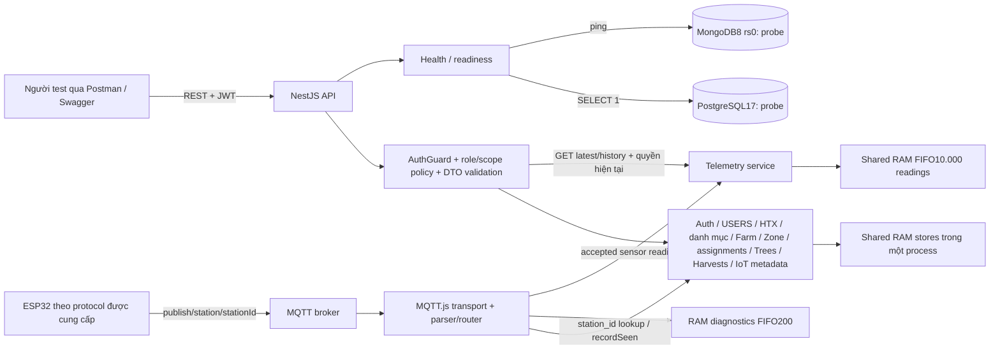
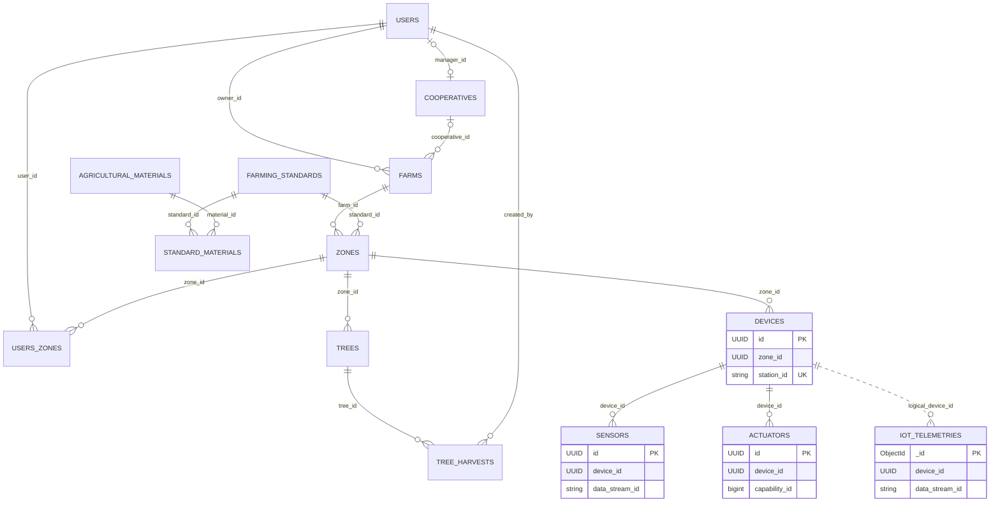
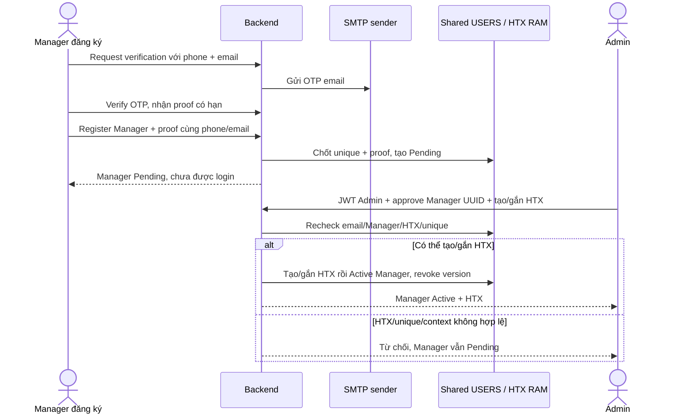
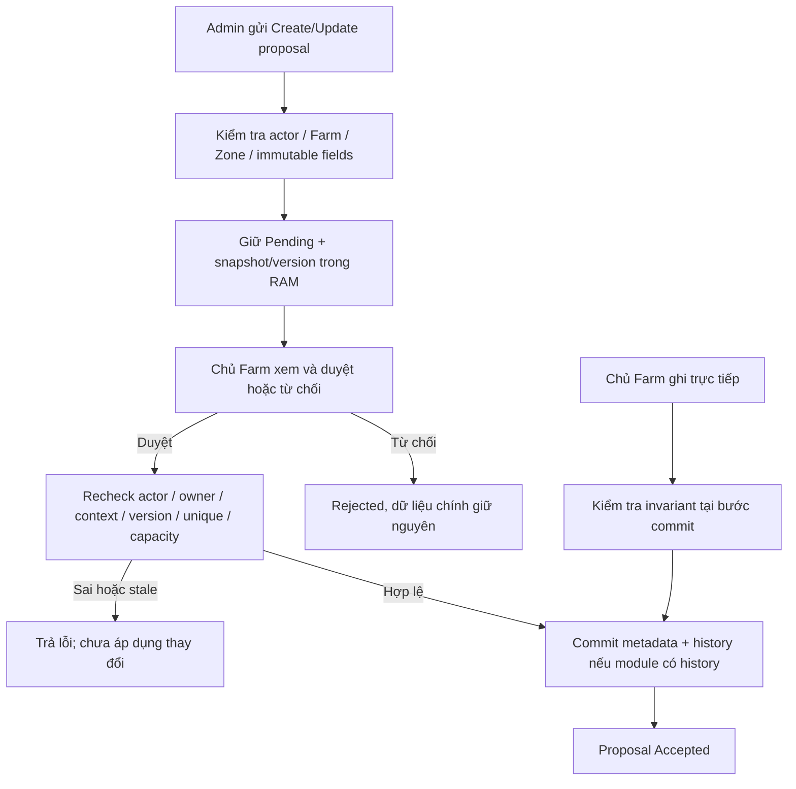
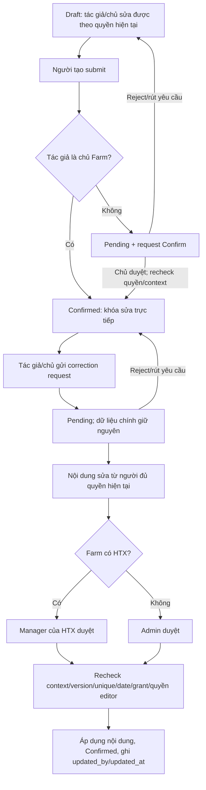

# Sơ đồ nền tảng đã triển khai — 2026-10-07

Mốc code **f20f6c1**, **147/147 tests** cùng lint/typecheck/build đạt trong lượt rà soát. Mermaid source nằm trực tiếp trong Markdown để session sau chỉnh/tái sử dụng. Đây là sơ đồ hiện trạng theo code và test, không khẳng định đã kiểm thử mọi tình huống hoặc ESP32 thật. Xem [bằng chứng/giới hạn](PROJECT_READINESS_REVIEW_20261007.md).

Các sơ đồ không thay ERD_DIAGRAM.xml của người dùng. PostgreSQL/MongoDB bên dưới chưa có business persistence; React web/mobile, ACTUATOR_TASKS và Cultivation chưa triển khai.

## 1. Kiến trúc runtime hiện tại



Không có đường Domain→PostgreSQL/MongoDB ghi nghiệp vụ hiện tại. Publisher nội bộ MQTT đã có nhưng chưa được nối với HTTP control/task orchestration. Sơ đồ không tự chứng minh ESP32 thực đã hoạt động với bản backend này.

Căn cứ: `apps/api/src/app.module.ts`, `application.ts`, `database/database.service.ts`, `mqtt/mqtt.module.ts`, `mqtt/mqtt.service.ts`, `telemetry/telemetry.module.ts`; `mqtt-loopback.test.ts`, `readiness.test.ts`, `telemetry.test.ts`.

## 2. Quan hệ logic của phần đã có



Quan hệ được kiểm tra ở backend/RAM, **chưa có DB foreign keys**. USERS→COOPERATIVES chỉ áp dụng user role Manager; manager_id nullable, một Manager tối đa một HTX. Một Farm có thể độc lập; mỗi Zone có một tiêu chuẩn, tiêu chuẩn mới gắn phải Active.

SENSORS unique **(device_id,data_stream_id)**, ACTUATORS unique **(device_id,capability_id)**; UK không đặt riêng lên stream/capability toàn hệ thống. Telemetry xác định stream bằng Device UUID + data_stream_id, không dùng station_id làm FK. Mọi Tree/Device cùng Zone có quan hệ qua Zone; không có TREES.device_id. Sơ đồ rút gọn field, không dùng trực tiếp làm migration.

Căn cứ: ERD_DIAGRAM.xml, các service/types hiện tại; `catalog.test.ts`, `zones.test.ts`, `assignments.test.ts`, `devices.test.ts`, `sensors.test.ts`, `actuators.test.ts`, `iot-metadata-update.test.ts`.

## 3. Đăng ký và duyệt Manager



Commit đồng bộ RAM là nguyên tử trong một process, không phải transaction SQL. Farmer đăng ký Active ngay, email tùy chọn; Admin không đăng ký công khai. UUID xuất hiện trong URL không thay thế JWT/quyền Admin.

Căn cứ: `users/users.service.ts`, `users/email/email-verification.service.ts`, `users/mock-cooperative.store.ts`; `users.test.ts` gồm proof deadline/partial-create regressions.

## 4. Admin đề xuất thay đổi metadata, chủ Farm duyệt



Áp dụng Zone/Tree/Device/Sensor/Actuator theo service tương ứng; Zone dùng kiểm tra diện tích/tiêu chuẩn, IoT dùng uniqueness/immutable IDs. Farmer nhận phân công chỉ đọc metadata. **Farm là luồng riêng:** cả chủ tạo/sửa cũng phải qua duyệt đối ứng Admin; gia nhập còn cần Manager, rời chỉ thông báo Manager. Không áp sơ đồ direct-write metadata sang FARMS.

Căn cứ: các `zones`, `trees`, `devices`, `sensors`, `actuators` service; tests approvals/stale/unique/capacity. Farm khác biệt theo `farms.service.ts` và `farms.test.ts`.

## 5. Thu hoạch và duyệt nội dung sửa



Xác nhận đầu tiên giữ updated_by/updated_at null. Tác giả hết phân công được gửi lý do, chủ chuẩn bị nội dung; editor phải có quyền hiện tại khi duyệt. Harvest dùng policy riêng, không áp hash/immutable Cultivation15 phút hoặc quyền correction theo assignment gốc của Cultivation. Chỉ xóa Draft chưa từng Confirmed; cùng tree/ngày không trùng, batch nhiều cây cùng Zone/ngày; nhập bù quá7 ngày lịch Việt Nam cần grant Admin.

Căn cứ: `tree-harvests/tree-harvests.service.ts`, `harvest-date-policy.ts`; `tree-harvests.test.ts`.

## 6. MQTT nhận Telemetry và quyền đọc

```mermaid
sequenceDiagram
    participant Wire as MQTT.js transport
    participant Router as MQTT parser/router
    participant Meta as Shared Device / Sensor stores
    participant T as Telemetry service / RAM FIFO
    actor User as Người dùng JWT
    Wire->>Router: topic + payload + retained flag
    Router->>Meta: station_id từ topic → Device UUID
    Router->>Router: Reject retained/identity mismatch/malformed/unknown station
    alt Telemetry hợp lệ
        Router->>Meta: recordSeen; map Device UUID + stream
        Router->>Router: Chỉ Device/Sensor Active; giữ raw unit
        Router->>T: Accepted readings + backend arrival time
        T->>T: Validate batch; capture received_at; append FIFO10.000
    else Short ACK hợp lệ
        Router->>Meta: recordSeen
        Router->>Router: Ghi diagnostics; chưa confirm task/relay
    end
    User->>T: GET Device latest/history
    T->>Meta: Kiểm tra scope hiện tại
    T->>T: Farmer: assignment hiện tại; lọc readings theo khoảng assignment
    T-->>User: Page + total + RAM storage metadata, hoặc lỗi quyền
```

measured_at là backend arrival/đọc packet, chưa phải đồng hồ đo thực ở hardware; received_at là lúc ghi RAM. latest lấy sau lọc quyền; assignment mới không mở readings từ phân công cũ. Hết phân công mất cả latest/history IoT. Không có HTTP giả lập reading cho người dùng, Mongo persistence hoặc frontend realtime trong luồng hiện tại.

Căn cứ: `mqtt/mqtt.protocol.ts`, `mqtt/mqtt.service.ts`, `telemetry/telemetry.service.ts`, `telemetry/telemetry.store.ts`; `mqtt.test.ts`, `mqtt-loopback.test.ts`, `telemetry.test.ts`.

## 7. Dùng trong luận văn và session sau

Mỗi sơ đồ phải đi cùng mốc commit, mô tả dữ liệu RAM, test evidence và giới hạn hardware/DB. Có thể dùng Mermaid trong trình xem hỗ trợ để render/xuất SVG, hoặc vẽ lại UML theo các bước này. Lượt này đã rà cấu trúc/source; chưa xuất ảnh hoặc kiểm tra bằng Mermaid renderer.

Khi triển khai frontend/persistence/control, cập nhật sơ đồ tương ứng sau nghiệm thu. Các hành vi future hash-chain, ACK-confirmation, auto-reset/shutdown, AI và chatbot cần sơ đồ thiết kế riêng ghi rõ trạng thái dự kiến.
